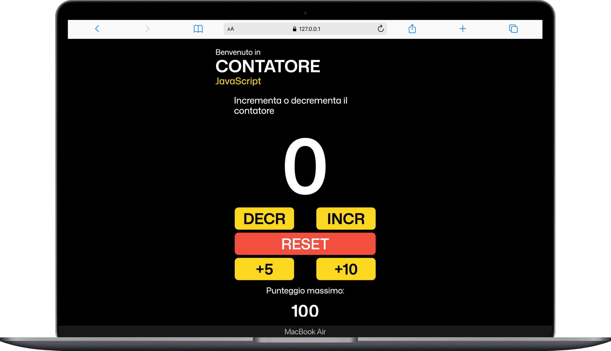

# JavaScript Counter - Start2Impact


## Obiettivo

Il progetto nasce come esercizio pratico per il percorso Start2Impact e ha l'obiettivo di realizzare un contatore interattivo con JavaScript, curando sia la logica dell'applicazione sia la struttura dell'interfaccia.

L'applicazione permette di modificare il valore del contatore, salvare il punteggio massimo raggiunto e cambiare tema visivo tramite una modalita chiara.

## Repository

Repository GitHub: [JS_Counter_s2i](https://github.com/Salvatore1712/JS_Counter_s2i)

## Funzionalita

- Incremento e decremento del contatore.
- Reset del valore a `0`.
- Bottoni extra per aumentare il valore di `+5` e `+10`.
- Evidenza visiva quando il valore raggiunge o supera `20`.
- Salvataggio del punteggio massimo con `localStorage`.
- Light mode attivabile tramite pulsante.
- Interfaccia responsive realizzata con SCSS.

## Tecnologie

- HTML5
- SCSS / Sass
- CSS3
- JavaScript
- LocalStorage API

## Struttura del progetto

```text
JS_Counter_s2i/
├─ index.html
├─ README.md
├─ package.json
├─ assets/
│  └─ img/
│     ├─ logo_counter.svg
│     ├─ Logo_counter_new.svg
│     ├─ logo_counter.png
│     ├─ sun_icon.png
│     └─ background_big.jpg
├─ src/
│  ├─ js/
│  │  ├─ contatore.js
│  │  ├─ funzContatore.js
│  │  └─ cambio_colore.js
│  └─ scss/
│     ├─ main.scss
│     ├─ abstract/
│     ├─ base/
│     ├─ components/
│     ├─ layout/
│     └─ pages/
├─ dist/
│  └─ css/
│     ├─ main.css
│     └─ main.css.map
└─ css/
   ├─ main.css
   └─ main.css.map
```

## Come avviare il progetto

Il progetto e una pagina statica. Per visualizzarlo e sufficiente aprire `index.html` nel browser.

In alternativa, puoi usare un server locale dalla cartella del progetto:

```bash
python3 -m http.server 5500
```

Poi apri `http://localhost:5500` nel browser.

## Compilazione SCSS

Il file HTML usa il CSS compilato in `dist/css/main.css`.

Per ricompilare gli stili partendo da `src/scss/main.scss`:

```bash
npx sass src/scss/main.scss dist/css/main.css --watch
```

## Logica JavaScript

### `src/js/contatore.js`

Gestisce l'interfaccia e gli eventi principali:

- aspetta il caricamento del DOM;
- seleziona gli elementi della pagina;
- inizializza il contatore a `0`;
- legge il punteggio massimo salvato in `localStorage`;
- crea dinamicamente i bottoni `DECR`, `INCR`, `RESET`, `+5` e `+10`;
- collega i click dei bottoni alle funzioni del contatore;
- aggiorna il punteggio massimo quando viene superato.

### `src/js/funzContatore.js`

Contiene le funzioni operative del contatore:

- `incrementa(counter, box)`: aumenta il valore di `1`;
- `decrementa(counter, box)`: diminuisce il valore di `1`;
- `reset(counter, box)`: riporta il valore a `0`;
- `piuCinque(counter, box)`: aumenta il valore di `5`;
- `piuDieci(counter, box)`: aumenta il valore di `10`.

Ogni funzione aggiorna il testo mostrato nella pagina e restituisce il nuovo valore del contatore, cosi lo stato rimane sincronizzato nel file principale.

Quando il valore arriva a `20` o oltre, il numero viene evidenziato in rosso.

### `src/js/cambio_colore.js`

Gestisce la modalita chiara:

- seleziona il pulsante `.light__mode`;
- al click applica o rimuove la classe `light_style` sul `body`;
- la classe modifica sfondo e colore del testo tramite SCSS.

## Stile

Gli stili sono organizzati in partial SCSS:

- `base`: reset e normalize;
- `abstract`: variabili, box, selettori e light mode;
- `layout`: header;
- `components`: bottoni;
- `pages`: stile della home page.

Il file principale `src/scss/main.scss` importa tutte le sezioni e genera il CSS finale usato dalla pagina.




## Autore

Progetto realizzato da [Salvatore De Roma](https://www.salvatorederoma.it).
